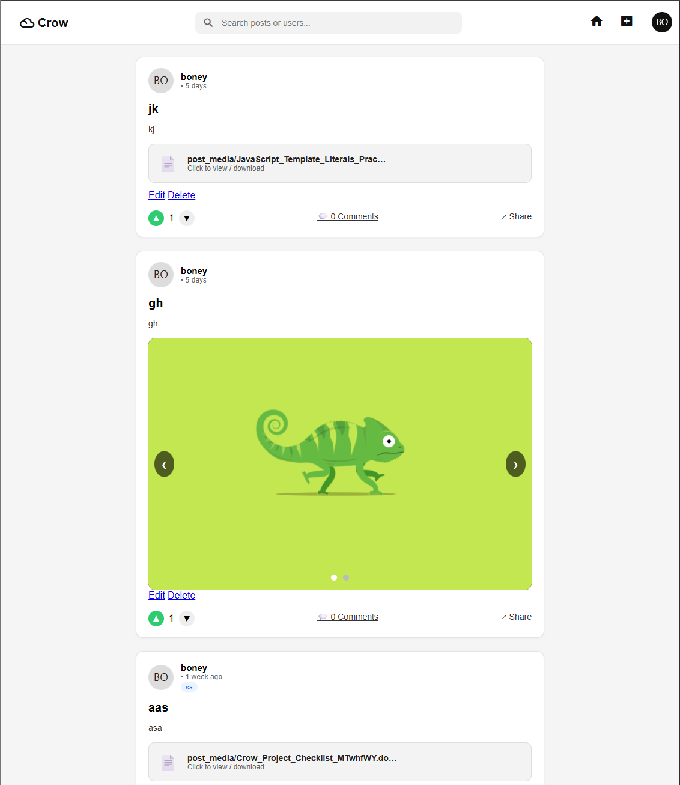
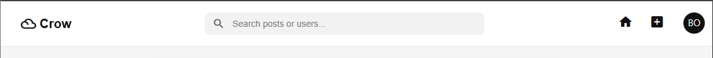
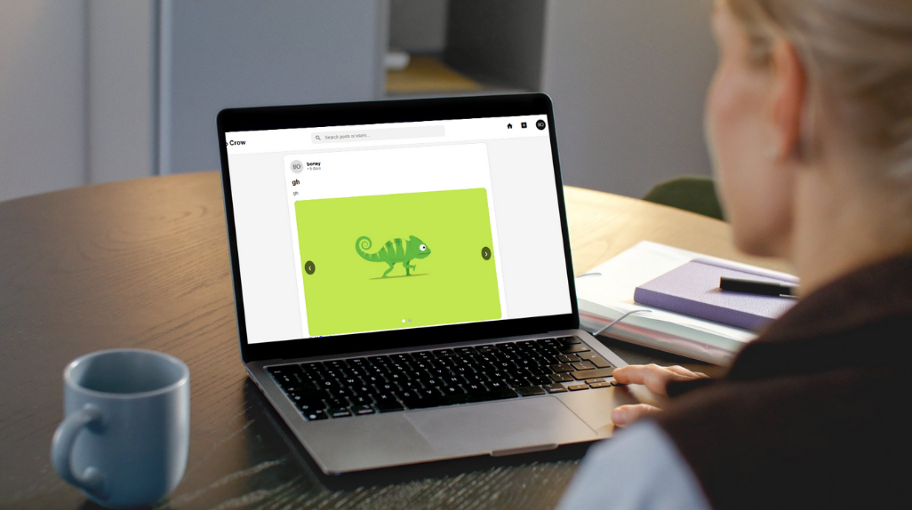

# 🐦 Crow – Social Feed Platform

Crow is a modern social feed platform that allows users to create, share, and interact with posts containing text, images, and videos. The application focuses on clean design, ease of use, and meaningful user interaction. Crow is designed to simulate a real-world social media feed while demonstrating full-stack development skills.

The platform is aimed at users who enjoy sharing short-form content and engaging with a community. Crow provides a solid foundation for a scalable social application with potential for future expansion.

---

## 🚀 Features

### Existing Features

#### 🔐 User Authentication
- Users can register, log in, and log out securely.
- Authentication ensures only authorized users can create and interact with posts.
- Provides a personalized experience for each user.

#### 📝 Create Post
- Users can create posts with text, images, or videos.
- Media uploads improve engagement and content richness.
- The interface is simple and intuitive.

#### 🖼️ Media Feed
- All posts are displayed in a central feed.
- Users can view images and videos directly within posts.
- Clean layout ensures easy content consumption.

#### 💬 User Interaction
- Users can like or react to posts.
- Interaction encourages engagement and community activity.
- Feedback is reflected dynamically in the interface.

#### 📱 Responsive Design
- Fully responsive across desktop, tablet, and mobile devices.
- Layout adapts smoothly to different screen sizes.
- Ensures accessibility on all devices.

#### 🧭 Navigation
- Consistent navigation bar across all pages.
- Allows easy access to core features.
- Improves overall user experience.

---

### 🔮 Features Left to Implement

- Comment system on posts
- User profile pages
- Follow and unfollow functionality
- Notifications system
- Admin moderation tools
- Post categories or hashtags

---

## 🧪 Testing

Testing was carried out to ensure the application functions correctly and provides a smooth user experience.

### Manual Testing
- All navigation links were tested across pages.
- Post creation tested with text, image, and video uploads.
- Login and logout functionality verified.
- Responsive behavior tested on multiple screen sizes.

### Browser Compatibility
- Google Chrome
- Mozilla Firefox
- Microsoft Edge

---

### ✅ Validator Testing

- **HTML**
  - No errors found when passing through the W3C HTML Validator.
- **CSS**
  - No errors found when passing through the W3C CSS Validator.
- **Python**
  - Code checked using Flake8 with issues resolved.

---

### 🐞 Unfixed Bugs

- Minor inconsistencies in media preview for certain video formats.
- These issues are browser-related and will be addressed in future updates.

---

## 🌍 Deployment

The project was deployed using an online hosting platform.

### Deployment Steps
1. Navigate to the project repository on GitHub.
2. Open the **Settings** tab.
3. Select **Pages** from the sidebar.
4. Choose the main branch as the source.
5. Save the changes and wait for deployment confirmation.

🔗 **Live Site:**  
`https://web-production-0574.up.railway.app/`

---

## 🛠️ Technologies Used

- HTML5
- CSS3
- JavaScript
- Python
- Django
- PostgreSQL / SQLite
- Cloudinary
- Git & GitHub

---

## 📁 Project Structure

crow/
│
├── templates/
├── static/
├── media/
├── posts/
├── users/
├── manage.py
└── README.md

---

## 🧠 Learning Outcomes

- Implemented full CRUD functionality for user posts
- Integrated media uploads using Cloudinary
- Applied user authentication and authorization
- Designed a responsive and accessible interface
- Deployed a full-stack application to production
- Used GitHub for version control and project management

---

## 📊 Assessment Criteria Mapping

- **User Authentication:** Login and registration system
- **CRUD Functionality:** Create, read, update, and delete posts
- **Frontend Design:** Responsive UI with consistent navigation
- **Backend Logic:** Django models, views, and forms
- **Deployment:** Live application hosted online

---

## 🙏 Credits

### Content
- Project inspired by Code Institute learning materials.
- Social feed UX inspired by modern social media platforms.

### Media
- Icons sourced from Font Awesome.
- Images and videos used for testing are user-generated or from open-source resources.

### Tools
- railway.com (https://railway.com/invite/3bdUR9J-jRD)
- Visual Studio Code
- GitHub
- Cloudinary

---

## 🏁 Final Note

Crow represents a strong foundation for a scalable social platform. The project demonstrates core full-stack development skills and provides a clear path for future enhancements and feature expansion.
